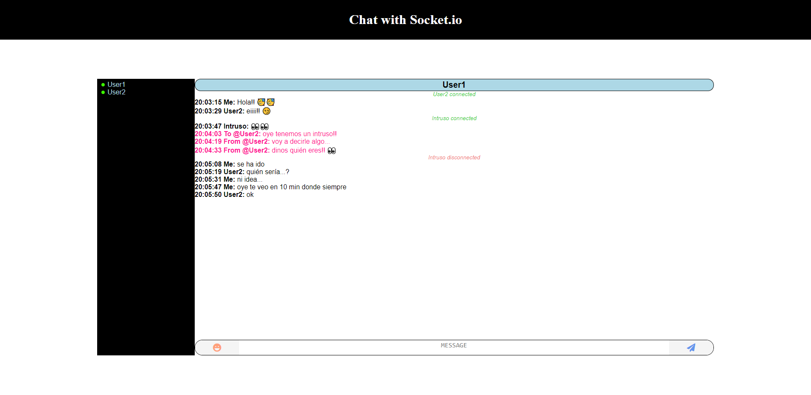

# Chat with Socket io
## Author: Francisco Javier González Sabariego

---

<div style="text-align: left;">
    
    
    
    <a href="https://twitter.com/intent/follow?screen_name=Fco_Javier_Glez" target="_blank">
        
    </a>
</div>

---

## Índice 
1. [Descripción y enlace a la demo](#descripción)
2. [Enlace a la demo](#enlace-a-la-demo)
3. [Información sobre despliegue](#despliegue)
4. [Autor](#autor)

### Descripción:
Un chat sencillo para aprender websockets la librería [Socket.io](https://socket.io/)


Las herramientas empleadas para este desarrollo han sido:


[:arrow_up:](#chat-with-socket-io)

### Enlace a la demo:
[Demo del chat](https://example-chat-socketio.herokuapp.com/)

[:arrow_up:](#chat-with-socket-io)


### Despliegue:

Hay que tener instalado [Node.js](https://nodejs.org/es/) en una versión 12+.

**Clonamos el proyecto:**
```
git clone https://github.com/FcoJavierGlez/chat_socket.io .
```

**Instalamos las dependecias:**
```
npm install
```

**Iniciamos:**
```
npm start
```

[:arrow_up:](#chat-with-socket-io)

### Autor:
- GitHub: [FcoJavierGlez](https://github.com/FcoJavierGlez)
- LinkedIn: [Francisco Javier González Sabariego](https://www.linkedin.com/in/francisco-javier-gonz%C3%A1lez-sabariego-51052a175/)
- Twitter: [@Fco_Javier_Glez](https://twitter.com/Fco_Javier_Glez)

[:arrow_up:](#chat-with-socket-io)
